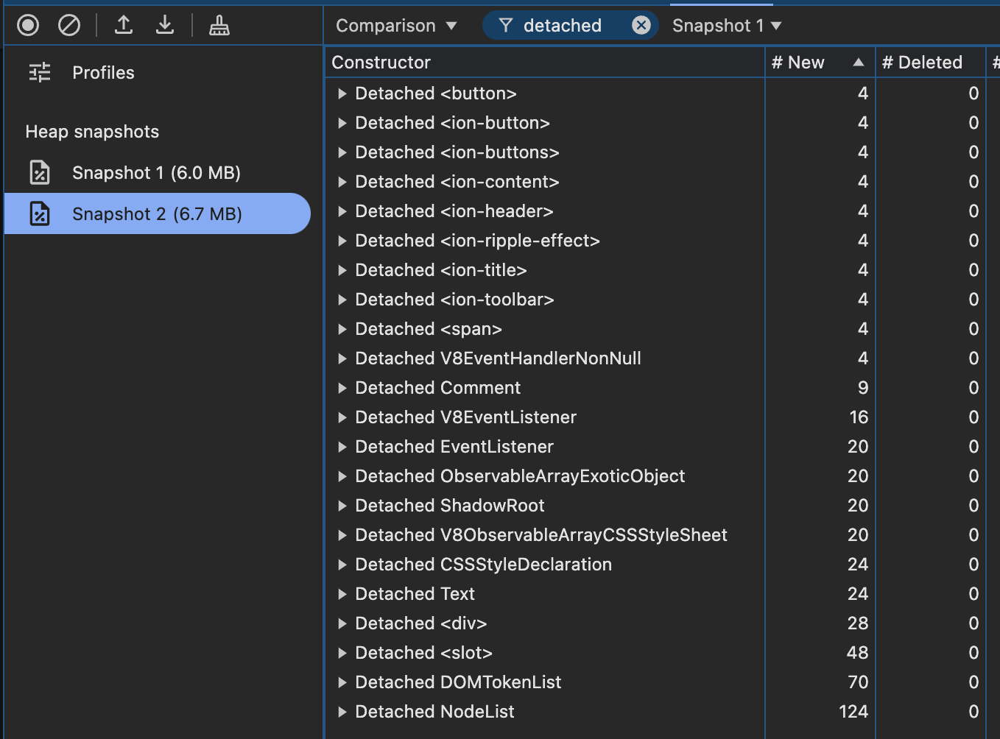

# Modal Creates Detached DOM Nodes
The repository is a reproduction to demonstrate the using an `IonModal` results in detached DOM nodes.

## Reproduction Steps
1. Run `npm instal`
1. Run `ionic serve`
1. In Chrome, be sure to view the app in incognito mode. Launch the Dev Tools and open the Memory tab.
1. Trigger garbage collection and take a snapshot
1. Open/close the modal 4 times
1. Trigger garbage collection and take a snapshot
1. Select the 2nd snapshot, choose "Comparison" mode and pick the first snapshot to compare to.
1. Search for "detached" and notice 4 detached DOM nodes for components like `<ion-content>`, `<ion-title>`, or `<ion-button>`

## Screenshot of Reproduction Results

  

